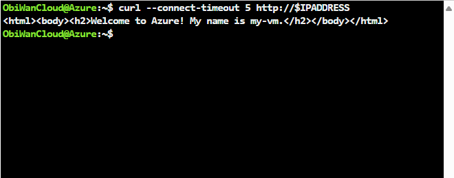
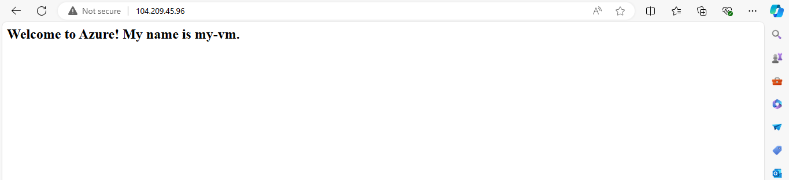
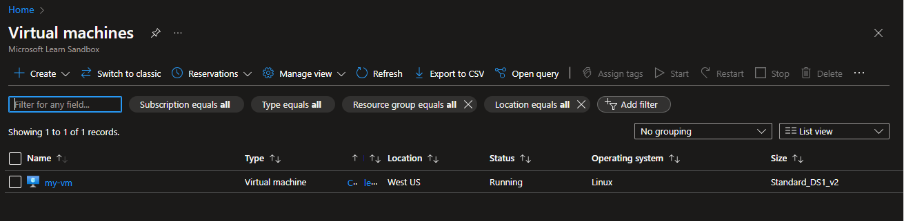
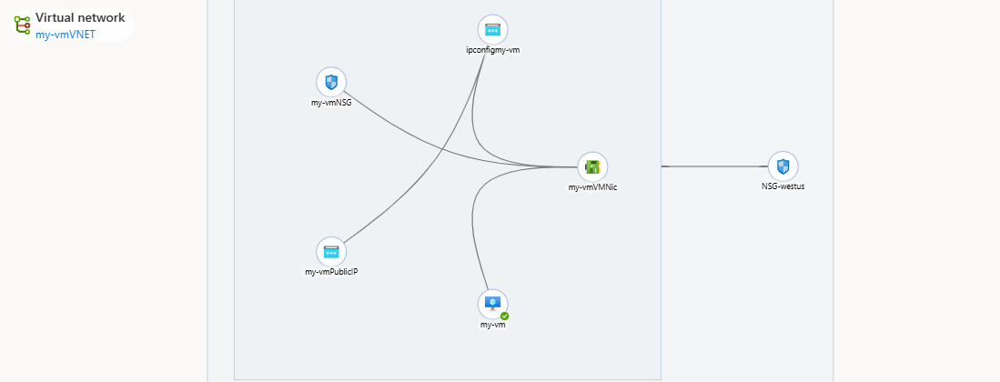

## MICROSOFT AZURE FUNDAMENTALS AZ-900
make you sign up for Microsoft training and follow the training for AZ-900

#Exercise - Create an Azure virtual machine
- login with you microsoft account
- verify that you are a human being
- wait for the Azure Cloud Shell to load
# CHANGING BASH PROMPT
- update the command below and replace *YOUR NICKNAME GOES HERE* with your nickname or username you want.
- PS1="\[\033[01;32m\]*YOUR NICKNAME GOES HERE*@Azure\[\033[01;37m\]:~$ "

## CREATING YOUR FIRST VM

# From Cloud Shell, run the following az vm create command to create a Linux VM:
- copy this command from your learning AZ-900 path(Describe Azure compute and networking services, under unit 3 )
- To learn more about the Bash shell, you can list commands by typing in: AZ --help
- once, the exercis is done, you can use the Azure portal GUI to view the details about your VM 
Shell:

on Port 80:

# login to the Azure Portal:
this will allow you to get familiar with portal
 - [ https://portal.azure.com/ ]

Network info:

