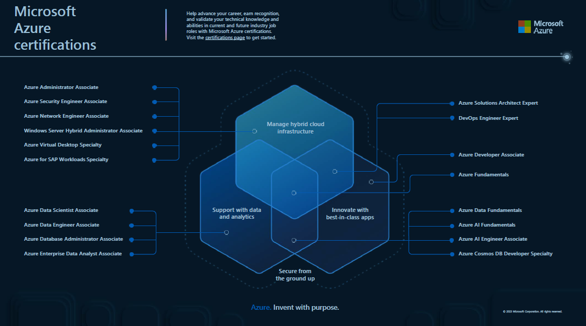
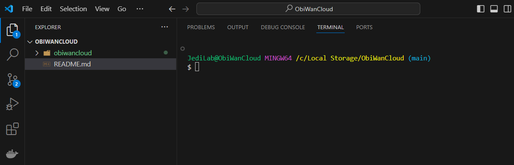
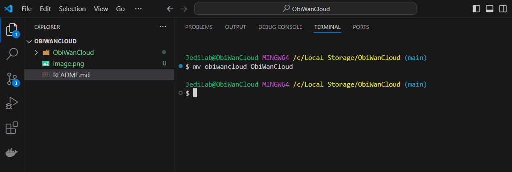
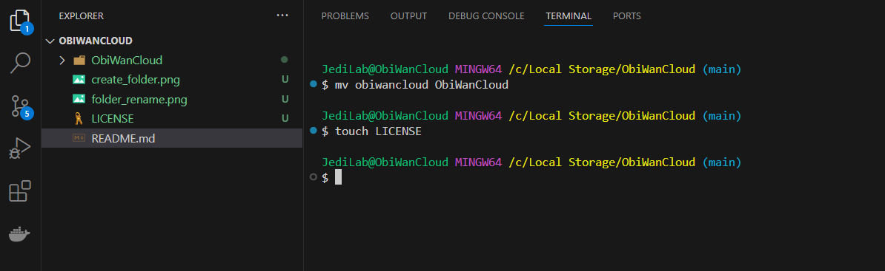
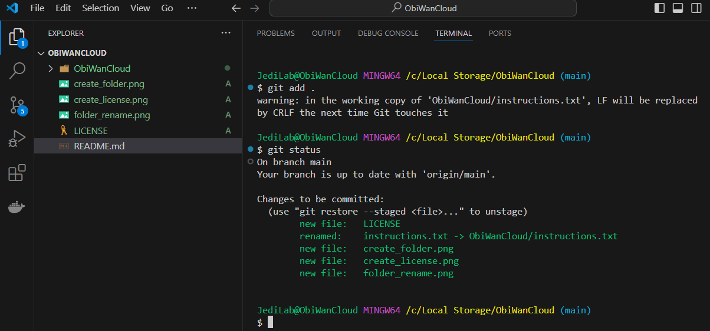

## Welcome to ObiWanCloud Project:
Hello and welcome to the ObiWanCloud Project! This repository is dedicated to documenting my journey through the Microsoft Azure learning path. My goal is to gain a strong foundation in cloud computing and share my progress, insights, and resources with the community. We will go from setting up the basic environment to learning the Fundamentals, then will move to creating a project, be a Developer, do some DevOps, and eventually move to Solution Architect.

## What You'll Find Here
Learning Progress: Regular updates on the modules and topics I've covered.
Notes and Summaries: Detailed notes and summaries of key concepts.
Practical Exercises: Code samples, scripts, and practical exercises that demonstrate the application of concepts learned.
Resources: Links to additional resources, articles, and tutorials that I've found helpful.

## Why Follow Along?
Whether you're new to cloud computing or looking to solidify your foundational knowledge, this project can serve as a valuable resource. By following along, you'll gain insights into the learning process, discover useful resources, and see practical applications of Azure concepts. Steps are given from a beginner's perspective on how to set up their VS Code environment, log in to their Microsoft learning account, and follow along with the modules hands-on, learning the Azure Shell and Azure Portal.

## How to Use This Repository
Clone the Repository: Feel free to clone this repository to your local machine to follow along more closely.
Contribute: If you have suggestions, additional resources, or corrections, please contribute! Your input is welcome and appreciated.
Stay Updated: Watch the repository to get notified of updates and new content.
Connect with Me
I'm excited to share this journey with you and look forward to learning together. If you have any questions, suggestions, or just want to connect, feel free to reach out.

LinkedIn: www.linkedin.com/in/
rubin-mathias-012696111

Thank you for stopping by, and happy learning!

## download VS Code, Git, Git Bash :
1. download VS code: https://code.visualstudio.com/
2. Download and isntall GIT: https://git-scm.com/
3. Once GIT is install, reload the Visual Studio to recongnied the new Git install
4. Install the Git Bash plugin( I am using: Start git-bash v1.2.1 by McCarter, version number will change)
5. Now initialized the source control to Git(login and grant access to your local VS code)
6. create an account or login with your existing Microsoft account: https://learn.microsoft.com/en-us/
7. choose your path(Azure Fundamental for beginners, DevOps, or Solution) and track your progress. this track is for Azure Fundamental for now.

## Why we recommend you to use Git Bash Plugin
Throughout this project, we recommend using the Git Bash plugin. The main reason for this is that the hands-on labs in the Azure fundamental learning path, the hands on lab require the use of the Azure Shell to run commands(Learn this first, then move to the Azure Portal to view, manage, verify settings, etc..). Therefore, it is beneficial to use or learn Linux Bash, as it closely resembles the Azure Cloud Shell environment. This will provide a seamless experience when running commands locally and in the cloud, enhancing your understanding and proficiency in using Azure.

## Git Configuration

Setting Up Git to Track the Project
To effectively track your project with Git, you need to configure Git properly, otherwise commands like commit, status, etc., won't work from the Bash shell. The first step is to set up your identity. Without this, you will encounter error messages when trying to make commits. Here’s how to do it:

# Set Up Your Name and Email:

# Step 1:
 
you must first set these 2 global variables:
- git config --global user.email "email@example.com"
- git config --global user.name  "Username"

# Verify Your Configuration:
git config --list

This ensures Git knows who is making the changes, which is essential for maintaining a clear history of your project contributions. Once your identity is set up, you can proceed with initializing a repository, making commits, and tracking your progress effectively.

## GIT INIT: Git initialization
git init

# Step 2
(This is to force you to use terminal commands instead of using GUI to create files and folder):
1. using the Linux command TOUCH "file name with extension" to create a new file
2. use VIM or NANO editor to edit the file, or just used the VS code editor
3. to view the content of the file, use the CAT command: CAT 'Filename'

## working with GIT BASH:
changing your bash prompt if you do not like to default:
edit this file: git-prompt.sh(found on your local machine here: C:\Program Files\Git\etc\profile.d\)
1. first make a backup copy of this file
2. then edit the file-> line 15 or look for this comment to know the correct line'# user@host<space>':
3. then edit this line: PS1="$PS1"'\u@\h ' # user@host<space> to # PS1="$PS1"'YOUR NAME@\h ' # user@host<space> (YOUR NAME is what you change) and save
 
# 1. Creating a folder using MKDIR command:
- mkdir obiwancloud (Mkdir 'Folder name')

- A. rename the folder if you make a mistake
mv obiwancloud ObiWanCloud (mv 'old_folder' 'New_folder')

# 2. create a file using the TOUCH Command:
TOUCH LICENSE (TOUCH 'File name[.]extension of the file')

# 3. GIT ADD: 
Now allow GIT to track the file by using the GIT ADD 'File name" command to track individual file to track or 'GIT ADD .' to track everything in the directory

## GIT STATUS: checking which files or folder has been tracked.
git status

## GIT COMMIT
git commit -m " Description"
